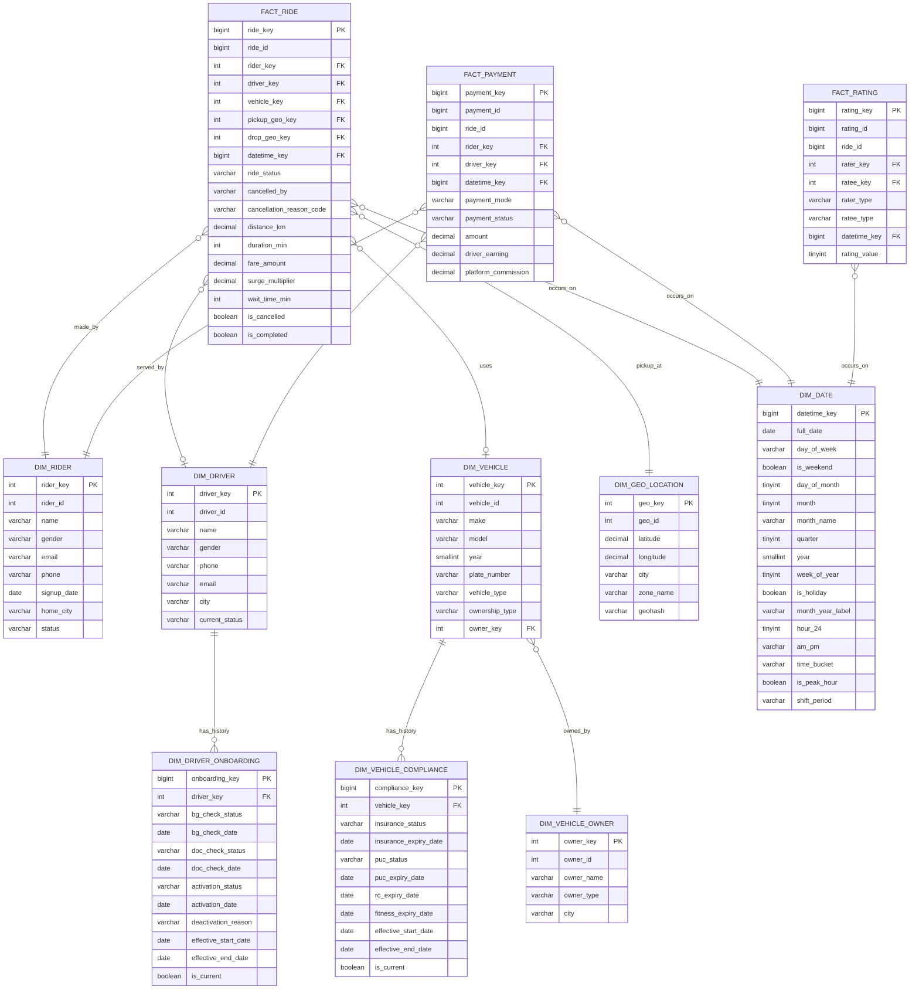

```mermaid
erDiagram
  FACT_RIDE }o--|| DIM_RIDER : made_by
  FACT_RIDE }o--o| DIM_DRIVER : served_by
  FACT_RIDE }o--o| DIM_VEHICLE : uses
  FACT_RIDE }o--|| DIM_GEO_LOCATION : pickup_at
  FACT_RIDE }o--|| DIM_DATE : occurs_on

  FACT_PAYMENT }o--|| DIM_RIDER : paid_by
  FACT_PAYMENT }o--|| DIM_DRIVER : paid_to
  FACT_PAYMENT }o--|| DIM_DATE : occurs_on

  FACT_RATING }o--|| DIM_DATE : occurs_on

  DIM_DRIVER ||--o{ DIM_DRIVER_ONBOARDING : has_history
  DIM_VEHICLE ||--o{ DIM_VEHICLE_COMPLIANCE : has_history
  DIM_VEHICLE }o--|| DIM_VEHICLE_OWNER : owned_by

  FACT_RIDE {
    bigint ride_key PK
    bigint ride_id
    int rider_key FK
    int driver_key FK
    int vehicle_key FK
    int pickup_geo_key FK
    int drop_geo_key FK
    bigint datetime_key FK
    varchar ride_status
    varchar cancelled_by
    varchar cancellation_reason_code
    decimal distance_km
    int duration_min
    decimal fare_amount
    decimal surge_multiplier
    int wait_time_min
    boolean is_cancelled
    boolean is_completed
  }

  FACT_PAYMENT {
    bigint payment_key PK
    bigint payment_id
    bigint ride_id
    int rider_key FK
    int driver_key FK
    bigint datetime_key FK
    varchar payment_mode
    varchar payment_status
    decimal amount
    decimal driver_earning
    decimal platform_commission
  }

  FACT_RATING {
    bigint rating_key PK
    bigint rating_id
    bigint ride_id
    int rater_key FK
    int ratee_key FK
    varchar rater_type
    varchar ratee_type
    bigint datetime_key FK
    tinyint rating_value
  }

  DIM_RIDER {
    int rider_key PK
    int rider_id
    varchar name
    varchar gender
    varchar email
    varchar phone
    date signup_date
    varchar home_city
    varchar status
  }

  DIM_DRIVER {
    int driver_key PK
    int driver_id
    varchar name
    varchar gender
    varchar phone
    varchar email
    varchar city
    varchar current_status
  }

  DIM_DRIVER_ONBOARDING {
    bigint onboarding_key PK
    int driver_key FK
    varchar bg_check_status
    date bg_check_date
    varchar doc_check_status
    date doc_check_date
    varchar activation_status
    date activation_date
    varchar deactivation_reason
    date effective_start_date
    date effective_end_date
    boolean is_current
  }

  DIM_VEHICLE {
    int vehicle_key PK
    int vehicle_id
    varchar make
    varchar model
    smallint year
    varchar plate_number
    varchar vehicle_type
    varchar ownership_type
    int owner_key FK
  }

  DIM_VEHICLE_OWNER {
    int owner_key PK
    int owner_id
    varchar owner_name
    varchar owner_type
    varchar city
  }

  DIM_VEHICLE_COMPLIANCE {
    bigint compliance_key PK
    int vehicle_key FK
    varchar insurance_status
    date insurance_expiry_date
    varchar puc_status
    date puc_expiry_date
    date rc_expiry_date
    date fitness_expiry_date
    date effective_start_date
    date effective_end_date
    boolean is_current
  }

  DIM_GEO_LOCATION {
    int geo_key PK
    int geo_id
    decimal latitude
    decimal longitude
    varchar city
    varchar zone_name
    varchar geohash
  }

  DIM_DATE {
    bigint datetime_key PK
    date full_date
    varchar day_of_week
    boolean is_weekend
    tinyint day_of_month
    tinyint month
    varchar month_name
    tinyint quarter
    smallint year
    tinyint week_of_year
    boolean is_holiday
    varchar month_year_label
    tinyint hour_24
    varchar am_pm
    varchar time_bucket
    boolean is_peak_hour
    varchar shift_period
  }
```
