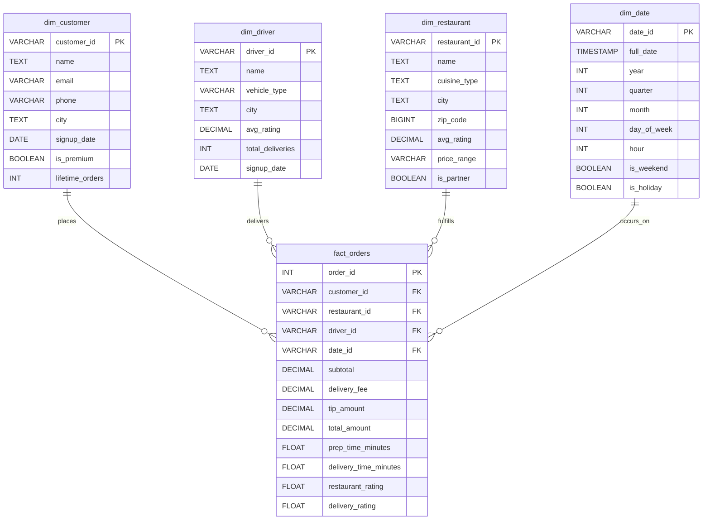

# Food Delivery Platform — Data Model

## Overview
This data model represents a food delivery platform, capturing orders placed by customers, deliveries made by drivers, and restaurant details. It follows a star schema design with `fact_orders` as the central fact table connected to four dimension tables.

## Entity Relationship Diagram

## Table Definitions

### dim_customer
| Column          | Type     | Description                        |
|------------------|----------|------------------------------------|
| customer_id      | VARCHAR  | Primary key, unique customer ID    |
| name             | TEXT     | Customer name                      |
| email            | VARCHAR  | Customer email                     |
| phone            | VARCHAR  | Customer phone number              |
| city             | TEXT     | Customer's city                    |
| signup_date      | DATE     | Date customer signed up            |
| is_premium       | BOOLEAN  | Whether customer has premium plan  |
| lifetime_orders  | INT      | Total orders placed by customer    |

### dim_driver
| Column           | Type     | Description                         |
|-------------------|----------|--------------------------------------|
| driver_id         | VARCHAR  | Primary key, unique driver ID        |
| name              | TEXT     | Driver name                          |
| vehicle_type      | VARCHAR  | Type of vehicle used for delivery    |
| city              | TEXT     | Driver's operating city              |
| avg_rating        | DECIMAL  | Average rating across deliveries     |
| total_deliveries  | INT      | Total deliveries completed           |
| signup_date       | DATE     | Date driver joined the platform      |

### dim_restaurant
| Column           | Type     | Description                          |
|-------------------|----------|----------------------------------------|
| restaurant_id     | VARCHAR  | Primary key, unique restaurant ID      |
| name              | TEXT     | Restaurant name                        |
| cuisine_type      | TEXT     | Type of cuisine offered                |
| city              | TEXT     | Restaurant's city                      |
| zip_code          | BIGINT   | Restaurant's zip code                  |
| avg_rating        | DECIMAL  | Average customer rating                |
| price_range       | VARCHAR  | Price tier (e.g. $, $$, $$$)           |
| is_partner        | BOOLEAN  | Whether restaurant is a partner        |

### dim_date
| Column       | Type      | Description                          |
|---------------|-----------|----------------------------------------|
| date_id       | VARCHAR   | Primary key, unique date ID            |
| full_date     | TIMESTAMP | Full timestamp of the date             |
| year          | INT       | Year                                    |
| quarter       | INT       | Quarter of the year (1-4)              |
| month         | INT       | Month (1-12)                           |
| day_of_week   | INT       | Day of week (0-6)                      |
| hour          | INT       | Hour of day (0-23)                     |
| is_weekend    | BOOLEAN   | Whether date falls on a weekend        |
| is_holiday    | BOOLEAN   | Whether date is a holiday              |

### fact_orders
| Column                 | Type     | Description                              |
|-------------------------|----------|---------------------------------------------|
| order_id               | INT      | Primary key, unique order ID               |
| customer_id            | VARCHAR  | FK to dim_customer                         |
| restaurant_id          | VARCHAR  | FK to dim_restaurant                       |
| driver_id              | VARCHAR  | FK to dim_driver                           |
| date_id                | VARCHAR  | FK to dim_date                             |
| subtotal               | DECIMAL  | Order subtotal before fees/tips            |
| delivery_fee           | DECIMAL  | Delivery fee charged                       |
| tip_amount             | DECIMAL  | Tip given to driver                        |
| total_amount           | DECIMAL  | Final order total                          |
| prep_time_minutes      | FLOAT    | Time taken by restaurant to prepare order  |
| delivery_time_minutes  | FLOAT    | Time taken for delivery                    |
| restaurant_rating      | FLOAT    | Rating given to restaurant for this order  |
| delivery_rating        | FLOAT    | Rating given to delivery for this order    |

## KPIs Supported

This schema is designed to support the following key performance indicators:

- Average delivery time
- Average order value
- Restaurant rating trends
- Driver efficiency
- Repeat order rate per customer

See [kpis.md](./kpis.md) for the full SQL queries.